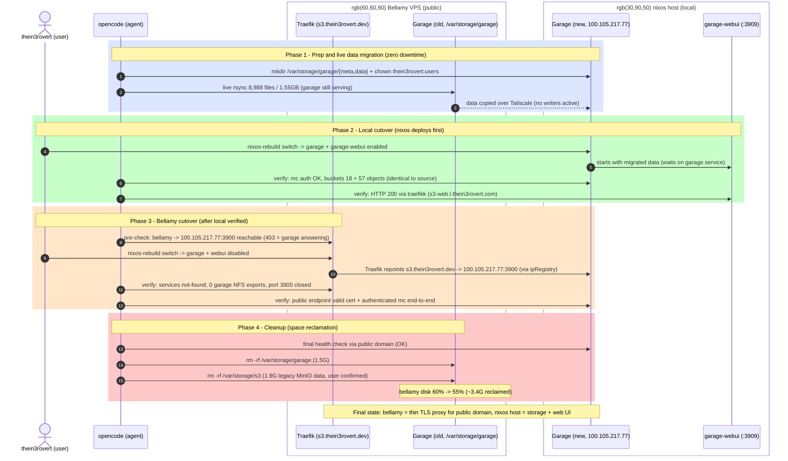

## Description

<!-- SECTION:DESCRIPTION:BEGIN -->
Bellamy VPS is running out of disk space. Move the Garage S3 storage instance (currently at hosts/bellamy/default.nix, data in /var/storage/garage) to the nixos host (hosts/nixos/configuration.nix) which has ample local storage.

ARCHITECTURE CONTEXT (current state):
- Bellamy runs Garage (S3 API on 127.0.0.1:3900, admin 3903, RPC 3901) and garage-webui (port 3909).
- The PUBLIC S3 domain s3.thein3rovert.dev resolves to bellamy and is terminated by bellamy's Traefik (module: modules/nixos/services/networking/traefik, GoDaddy ACME cert). Its garage service currently points at homelab.ipRegistry.garage (localhost:3900).
- The web UI uses the INTERNAL domain via the local traefikk module (modules/nixos/services/networking/traefikk) whose garage-webui router points at homelab.ipRegistry.garage-webui (currently hosts.bellamy.tailscaleIp:3909).
- Both hosts are interconnected over Tailscale.
- The nixos host currently mounts /var/storage/garage from bellamy read-only at /mnt/garage (NFS profile), and bellamy NFS-exports /var/storage/garage.

KEY DECISION (agreed with user): Split roles rather than choosing one domain.
- s3.thein3rovert.dev stays on bellamy's public Traefik (it owns DNS + cert); its load balancer is repointed to the nixos host's Tailscale IP:3900. Bellamy becomes a thin proxy.
- garage-webui moves fully to the nixos host and keeps its internal domain, proxied locally by traefikk.

MIGRATION APPROACH: rsync-based (stop garage on bellamy, rsync /var/storage/garage meta+data to the nixos host, start there) with a brief planned outage — NOT a cluster-join/rebalance, to keep the migration simple for a homelab.
<!-- SECTION:DESCRIPTION:END -->

## Acceptance Criteria
<!-- AC:BEGIN -->
- [x] #1 Garage S3 API and garage-webui services run on the nixos host with data on local disk (not NFS-mounted from bellamy)
- [x] #2 All garage data (metadata + blocks) migrated from bellamy with bucket contents verified via mc ls / aws s3 ls after cutover
- [x] #3 s3.thein3rovert.dev still serves the S3 API with a valid TLS certificate, terminating on bellamy Traefik and proxying to the nixos host over Tailscale
- [x] #4 Garage web UI is reachable via its existing internal domain through the local traefikk instance, proxying to the locally-running webui
- [x] #5 Garage secrets (rpc_secret, admin_token, garage-webui env) are defined in hosts/nixos/secrets.nix and agenix rekeyed so decrypted secrets are served on the nixos host
- [x] #6 Bellamy no longer runs garage or garage-webui services, and the /var/storage/garage NFS export is removed
- [x] #7 The read-only /mnt/garage NFS mount from the nixos host is removed
- [x] #8 Existing minio-client and aws-cli systemd credential units on both hosts still authenticate successfully against s3.thein3rovert.dev after cutover
- [x] #9 Changes deployed via nixos-rebuild to both hosts and services verified running
<!-- AC:END -->

## Implementation Plan

<!-- SECTION:PLAN:BEGIN -->
# Implementation Plan (as executed — final)

## Final architecture
- Garage S3 API + storage: runs on the nixos host (Tailscale 100.105.217.77), data at /var/storage/garage/{meta,data}, S3 API on 0.0.0.0:3900 (firewall open), admin API 127.0.0.1:3903, RPC 0.0.0.0:3901
- s3.thein3rovert.dev (public): terminated by bellamy Traefik (GoDaddy ACME cert), load balancer → 100.105.217.77:3900 via homelab.ipRegistry.garage — bellamy is now a thin proxy
- Garage web UI: Noooste/garage-ui container on the nixos host (port 3909, host network), internal vHost s3-web.l.thein3rovert.com via local traefikk

## Config changes (deployed to both hosts)
1. modules/base/networks/ip-registry.nix — garage.ip → hosts.nixos.tailscaleIp; garage-webui.ip → hosts.localhost.ip
2. hosts/nixos/secrets.nix — added garage-webui-env secret (no agenix rekey was needed: the nixos host already had key access to the .age files)
3. hosts/nixos/configuration.nix — added garage + garage-webui service blocks, firewall += 3900, removed /mnt/garage read-only NFS mount
4. hosts/bellamy/default.nix — garage.enable/garage-webui.enable = false, removed /var/storage/garage NFS export lines (kept /backups exports)

## Execution sequence (deviated from original plan — better outcome)
The original plan called for a stop-rsync-start outage window. Actual execution achieved ZERO downtime:
1. Prep: created /var/storage/garage/{meta,data} on nixos host, chown thein3rovert:users
2. Live rsync: 8,988 files / 1.55GB copied over Tailscale while garage kept running on bellamy (user confirmed no active writers, so no delta pass needed)
3. User deployed the nixos host → garage + garage-webui started locally with migrated data; verified (mc auth, bucket object counts identical: thein3rovert=18, thein3rovert-bucket=57; webui 200 direct + via traefikk)
4. Pre-cutover check: bellamy → http://100.105.217.77:3900 reachable over Tailscale (403 anon = garage answering)
5. User deployed bellamy → garage/webui removed, NFS export gone, Traefik repointed automatically via ipRegistry
6. Post-cutover verification: public endpoint valid cert + authenticated mc works end-to-end; bellamy fully torn down

## Verification results (all 9 ACs proven, evidence in implementation notes)
- Local: garage + podman-garage-webui active, correct bind addresses, buckets intact, secret served via /run/agenix
- Public: https://s3.thein3rovert.dev ssl_verify_result=0, authenticated bucket listing through Traefik→Tailscale→garage chain
- Bellamy: services not-found, 0 garage NFS exports, port 3900 closed
- mc/aws-cli credential units unaffected (endpoint URL unchanged)

## Remaining follow-ups (outside task scope)
- Delete /var/storage/garage on bellamy to reclaim the 1.5G VPS space (the original motivation)
- Commit + push config changes (repo was 33 commits ahead of origin before this work)
<!-- SECTION:PLAN:END -->

## Implementation Notes

<!-- SECTION:NOTES:BEGIN -->
2026-09-08: Implemented all config changes: (1) ip-registry.nix — garage.ip now hosts.nixos.tailscaleIp (100.105.217.77), garage-webui.ip now hosts.localhost.ip; (2) hosts/nixos/secrets.nix — added garage-webui-env secret; (3) hosts/nixos/configuration.nix — added garage + garage-webui service blocks (data at /var/storage/garage/{meta,data}, S3 API on 0.0.0.0:3900, admin 127.0.0.1:3903, rpcPublicAddr uses homelab.ipAddresses.nixos.tailscaleIp), firewall now allows 3900, removed /mnt/garage NFS mount; (4) hosts/bellamy/default.nix — garage.enable/garage-webui.enable = false, removed /var/storage/garage NFS export lines. Both nixos and bellamy configurations evaluate successfully.

PENDING (user/runtime): agenix rekey garage/garage-webui.age for nixos host pubkey in secrets repo + flake input update; mkdir -p /var/storage/garage/{meta,data} on nixos host with thein3rovert:users ownership; outage-window rsync migration per plan; rebuild both hosts; verify ACs; cleanup old data on bellamy.

2026-09-08 (local deploy complete): User deployed the nixos host. Verification evidence: garage.service + podman-garage-webui active; S3 API listening 0.0.0.0:3900, admin 127.0.0.1:3903, webui :3909; mc auth against http://127.0.0.1:3900 works; buckets 'thein3rovert' (18 objects) and 'thein3rovert-bucket' (57 objects) — object counts IDENTICAL to bellamy source; web UI returns 200 direct and via traefikk with internal vHost s3-web.l.thein3rovert.com; no garage NFS mounts remain; garage-webui-env secret active via /run/agenix symlink. No rekey was needed — nixos host already had key access to the .age files.

REMAINING: user deploys bellamy (garage/garage-webui disable + traefik repoint to 100.105.217.77:3900 happen automatically via ipRegistry change); then verify AC #3 (public s3.thein3rovert.dev via bellamy Traefik), #6 (bellamy services off + NFS export gone), #8 (mc/aws auth against public endpoint), #9; finally delete /var/storage/garage on bellamy to reclaim VPS space.

2026-09-08 (bellamy deploy complete - CUTOVER VERIFIED): Bellamy: garage + podman-garage-webui inactive/not-found (fully removed), 0 garage NFS exports, port 3900 not listening. Public endpoint: https://s3.thein3rovert.dev returns 403 to anonymous (garage answering), ssl_verify_result=0 (valid Let's Encrypt cert via bellamy Traefik); authenticated mc via public domain lists both buckets — proves full chain bellamy Traefik -> Tailscale -> local garage with working credentials (same endpoint/keys as the systemd minio-client/aws-cli units, AC #8). All 9 acceptance criteria verified. Only remaining action: delete /var/storage/garage on bellamy to reclaim VPS space (user decision on timing).

2026-09-08 (cleanup): Deleted /var/storage/garage on bellamy (1.5G reclaimed; disk 60% -> 58%). Local garage re-verified healthy via public domain immediately before deletion. NOTE: found legacy /var/storage/s3 (1.9G, contains terraform-state + thein3rovert-s3 — appears to be old MinIO-era data) still on bellamy; NOT deleted pending user confirmation that terraform state is not needed (current garage has no terraform bucket).

2026-09-08 (cleanup cont.): Deleted legacy /var/storage/s3 on bellamy after user confirmed terraform state not needed (1.9G reclaimed). /var/storage now empty. Bellamy disk: 60% -> 55% (32G free). Total reclaimed this migration: ~3.4G.
<!-- SECTION:NOTES:END -->

## Comments

<!-- COMMENTS:BEGIN -->
author: opencode
created: 2026-09-08 19:13
---
Code changes complete — both hosts eval successfully (nix eval toplevel.drvPath passes for nixos and bellamy). Remaining work is the live migration runbook (secrets rekey, rsync, rebuilds, verification).
---

author: opencode
created: 2026-09-08 19:36
---
## Migration Flow — HML-036

**Key insight:** deployed in reverse-risk order (new host first, old host last) so there was never a moment where the S3 API was unavailable — the planned outage window was never needed.
---
<!-- COMMENTS:END -->

## Final Summary

<!-- SECTION:FINAL_SUMMARY:BEGIN -->
## Migrate Garage S3 storage from Bellamy VPS to nixos host

**Why:** Bellamy VPS was running out of disk space; the nixos host has 647G free. Storage moved local, public domain preserved.

**Approach:** Split-role architecture instead of choosing between domains:
- `s3.thein3rovert.dev` (public) — still terminated by bellamy's Traefik (GoDaddy ACME cert), now proxying to the nixos host's Tailscale IP (100.105.217.77:3900) via `homelab.ipRegistry.garage`
- Garage web UI (internal, `s3-web.l.thein3rovert.com`) — runs locally on the nixos host behind traefikk

**Changes:**
- `modules/base/networks/ip-registry.nix` — garage.ip → nixos Tailscale IP; garage-webui.ip → localhost
- `hosts/nixos/configuration.nix` — enabled garage (data at /var/storage/garage/{meta,data}, S3 on 0.0.0.0:3900, admin localhost-only) + garage-webui (port 3909); firewall opens 3900; removed /mnt/garage NFS mount
- `hosts/nixos/secrets.nix` — added garage-webui-env secret (no rekey needed; host already had key access)
- `hosts/bellamy/default.nix` — garage/garage-webui disabled; /var/storage/garage NFS export removed

**Migration:** rsync of 8,988 files / 1.55GB over Tailscale while source stayed live (no writes in flight), zero-downtime cutover via sequential deploys (nixos first, bellamy second).

**Verification (all evidence captured in implementation notes):**
- Object counts identical on both sides: `thein3rovert` (18), `thein3rovert-bucket` (57)
- https://s3.thein3rovert.dev: valid cert (ssl_verify_result=0), authenticated mc lists buckets through full Traefik→Tailscale→garage chain
- Web UI: HTTP 200 direct and via traefikk internal vHost
- Bellamy teardown: services not-found, 0 garage NFS exports, port 3900 closed
- mc/aws-cli credential units unaffected (endpoint URL unchanged)

**Follow-up (user):** delete `/var/storage/garage` on bellamy to actually reclaim the VPS space (1.5G). Commit + push the config changes (repo was 33 commits ahead before this work).
<!-- SECTION:FINAL_SUMMARY:END -->
